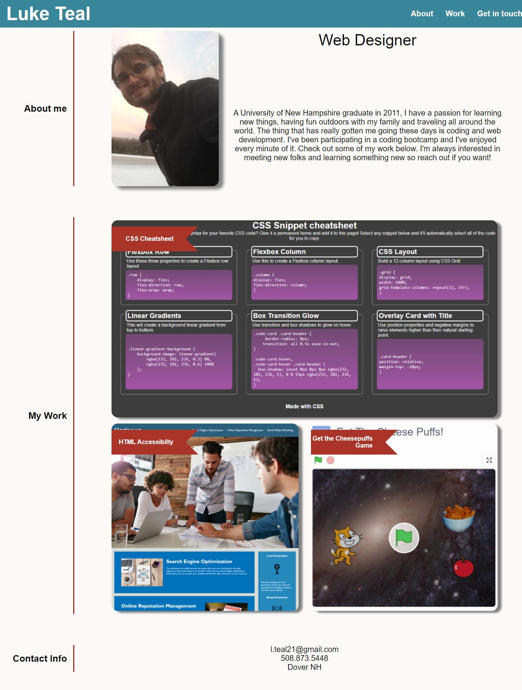

# Profile

This is my [web designer portfolio](https://luketeal.github.io/Profile/).  

It is built on React and highlights example projects and provides the functionality to contact me through a form.

## Repository Contents
The repository includes

* source code for react app including components for the about, work, contact and resume pages

## Objectives

The primary goal for this website is for it to be responsive to screensize, be built on react, and provide relevant information on my current work.

## Screenshot
The image below show's the web app's appearance:

## Credits

Normalize v8.0.1.css downloaded from Nicolas Gallagher's github page